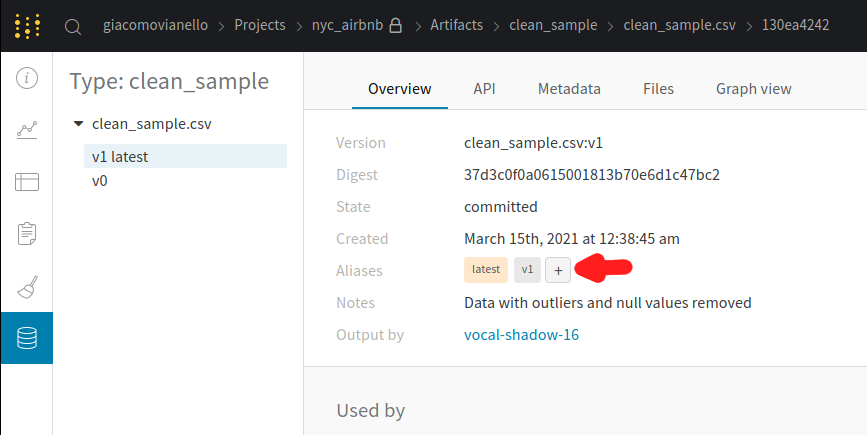
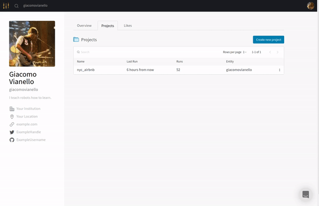
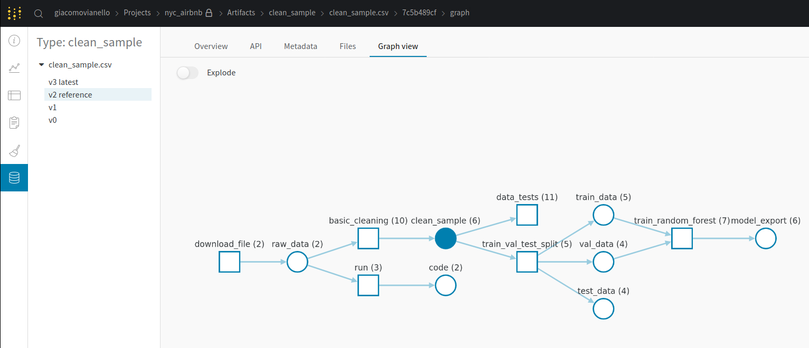
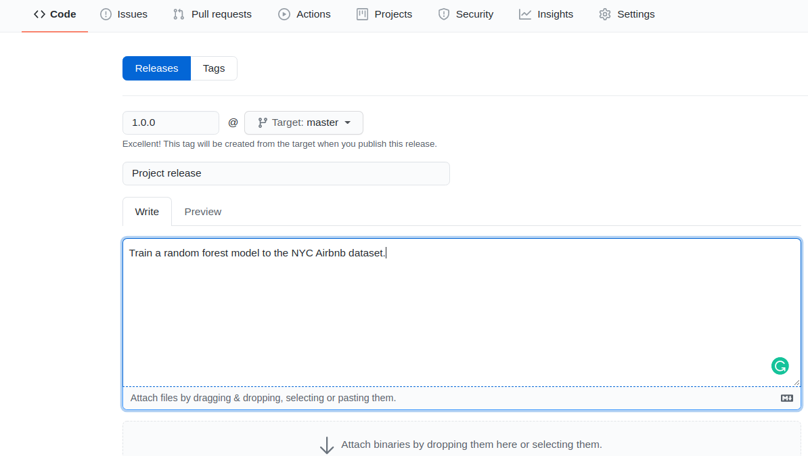

# Build an ML Pipeline for Short-Term Rental Prices in NYC
You are working for a property management company renting rooms and properties for short periods of 
time on various rental platforms. You need to estimate the typical price for a given property based 
on the price of similar properties. Your company receives new data in bulk every week. The model needs 
to be retrained with the same cadence, necessitating an end-to-end pipeline that can be reused.

In this project you will build such a pipeline.

## Table of contents

- [Introduction](#introduction)
- [Starter kit](#starter-kit)
  * [Preliminary steps](#preliminary-steps)
    + [Create environment](#create-environment)
    + [Get API key for Weights and Biases](#get-api-key-for-weights-and-biases)
  * [GitHub](#github)
  * [Cookie cutter](#cookie-cutter)
  * [The ``main.py`` file](#the-mainpy-file)
  * [The configuration](#the-configuration)
  * [Running the pipeline](#running-the-pipeline)
  * [Pre-existing steps](#pre-existing-steps)
- [Steps](#steps)
  * [Exploratory Data Analysis (EDA)](#exploratory-data-analysis-eda)
  * [Data cleaning](#data-cleaning)
  * [Data testing](#data-testing)
  * [Data splitting](#data-splitting)
  * [Train Random Forest](#train-random-forest)
  * [Optimize hyperparameters](#optimize-hyperparameters)
  * [Select the best model](#select-the-best-model)
  * [Test](#test)
  * [Visualize the pipeline](#visualize-the-pipeline)
  * [Release the pipeline](#release-the-pipeline)
  * [Train the model on a new data sample](#train-the-model-on-a-new-data-sample)

## Starter kit
You will start working on your project by downloading the starter kit. Create a new GitHub
repository, and commit and push the starter kit to it.

### Preliminary steps

#### Create environment
Make sure to have conda installed and ready, then create a new environment using the ``environment.yml``
file provided in the root of the starter kit and activate it:

```bash
> conda env create -f environment.yml
> conda activate nyc_airbnb_dev
```

#### Get API key for Weights and Biases
Get your API key from W&B by going to [https://wandb.ai/authorize](https://wandb.ai/authorize) 
and set this environment variable:

```bash
> export WANDB_API_KEY=[your API key]
```

Then login to W&B:

```bash
> wandb login $WANDB_API_KEY
```

### GitHub
Create a repository named ``nyc_airbnb`` in your github account and commit your code there. 
Commit and push to the repository often while you make progress towards the solution. Remember 
to add meaningful commit messages.

### Cookie cutter
You are also provided a cookie cutter template that you can use to create stubs for new pipeline steps. Just run
the cookiecutter and enter the required information. Remember to leave the default when asked for ``arguments``.
For example:

```bash
> pip install cookiecutter
> cookiecutter cookie-mlflow-step -o src

step_name [step_name]: basic_cleaning
script_name [run.py]: run.py
job_type [my_step]: basic_cleaning
short_description [My step]: This steps cleans the data
long_description [An example of a step using MLflow and Weights & Biases]: Performs basic cleaning on the data and save the results in Weights & Biases
parameters [parameter1,parameter2]: parameter1,parameter2,parameter3
```

This will create a step called ``basic_cleaning`` under the directory ``src`` with the following structure:

```bash
> ls src/basic_cleaning/
conda.yml  MLproject  run.py
```

You can now modify the script (``run.py``), the conda environment (``conda.yml``) and the project definition 
(``MLproject``) as you please.

The script ``run.py`` will receive the input parameters ``parameter1``, ``parameter2``,
``parameter3`` and it will be called like:

```bash
> mlflow run src/step_name -P parameter1=1 -P parameter2=2 -P parameter3="test"
```

### The ``main.py`` file
The pipeline is defined in the ``main.py`` file in the root of the starter kit. The file already
contains some boilerplate code as well as the download step. Your task will be to develop the
needed additional step, and then add them to the ``main.py`` file.

### The configuration
All the parameters controlling the pipeline are defined in the ``config.yaml`` file defined in
the root of the starter kit. Open this file and get familiar with its content. 
This file is only read by the ``main.py`` script (i.e., the pipeline) and its content is
available with the ``go`` function in ``main.py`` as the ``config`` dictionary. For example,
the name of the project is contained in the ``project_name`` key under the ``main`` section in
the configuration file. It can be accessed from the ``go`` function as 
``config["main"]["project_name"]``.

NOTE: do NOT hardcode any parameter when writing the pipeline. All the parameters should be 
accessed from the configuration file.

We will use Hydra to manage this configuration file. This means that every parameter can be
easily overridden from the command line (see the section Running the pipeline).

### Running the pipeline
In order to run the pipeline you need to be in the root of the starter kit, then you can execute:

```bash
>  mlflow run . -P wandb_api_key=${WANDB_API_KEY}
```
This will run the entire pipeline.

When developing it is useful to be able to run one step at the time. Say you want to run only
the ``download`` step (the steps are defined at the top of the ``main.py`` file, in the 
``_steps`` list)

```bash
> mlflow run . -P wandb_api_key=${WANDB_API_KEY} -P steps=download
```
If you want to run the ``download`` and the ``basic_cleaning`` steps, you can similarly do:
```bash
> mlflow run . -P wandb_api_key=${WANDB_API_KEY} -P steps=download,basic_cleaning
```
You can override any other parameter in the configuration file using the Hydra syntax, by
providing it as a ``override`` parameter. For example, say that we want to set the parameter
modeling -> random_forest -> n_estimators to 10 and etl->min_price to 50:

```bash
> mlflow run . \
  -P wandb_api_key=${WANDB_API_KEY} \
  -P steps=download,basic_cleaning \
  -P override="modeling.random_forest.n_estimators=10 etl.min_price=50"
```

### Pre-existing steps
In order to simulate a real-world situation, we are providing you with some pre-implemented
re-usable steps (``components``). In order to use them, refer to their ``MLproject`` file: there
you can find the parameters that they accept with a description.

## Steps

### Exploratory Data Analysis (EDA)
The scope of this section is to get an idea of how the process of an EDA works in the context of
pipelines, during the data exploration phase. In a real scenario you would spend a lot more time
in this phase, but here we are going to do the bare minimum.

NOTE: remember to add some markdown cells explaining what you are about to do, so that the
notebook can be understood by other people like your colleagues

1. The ``main.py`` script already comes with the download step implemented. Run the pipeline to 
   get a sample of the data. The pipeline will also upload it to Weights & Biases:
   
  ```bash
  > mlflow run . -P wandb_api_key=${WANDB_API_KEY}
  ```
  
  You will see a message similar to:

  ```
  2021-03-12 15:44:39,840 Uploading sample.csv to Weights & Biases
  ```
  This tells you that the data have been uploaded to W&B as the artifact named ``sample.csv``.

2. Go in the ``notebook`` directory and start Jupyter, and then create a notebook called ``EDA``.
3. Within the notebook, fetch the artifact we just created (``sample.csv``) from W&B and read 
   it with pandas:
    
    ```python
    import wandb
    import pandas as pd
    
    wandb.init(project="nyc_airbnb", group="eda", save_code=True)
    local_path = wandb.use_artifact("sample.csv:latest").file()
    df = pd.read_csv(local_path)
    ```
    Note the use of ``save_code=True`` in the call to ``wandb.init``. This makes sure that the
    code of the notebook is uploaded to W&B for versioning, so that each run of the notebook
    will be tied to the specific version of the code that run in that step.

4. Print a summary (df.info()) and note the null values. Also, note how there are clearly 
   outliers in the ``price`` column : 
   
   ```python
    df['price'].describe(percentiles=[0.01, 0.05, 0.50, 0.95, 0.99])
    count    20000.000000
    mean       153.269050
    std        243.325609
    min          0.000000
    1%          30.000000
    5%          40.000000
    50%        105.000000
    95%        350.000000
    99%        800.000000
    max      10000.000000
    Name: price, dtype: float64
   ```
   After talking to your stakeholders, you decide to consider from a minimum of $ 10 to a maximum
   of $ 350 per night.
   
5. Fix the little problems we have found in the data with the following code:
    
    ```python
    # Drop outliers
    min_price = 10
    max_price = 350
    idx = df['price'].between(min_price, max_price)
    df = df[idx]
   
    # Convert last_review to datetime
    df['last_review'] = pd.to_datetime(df['last_review'])

    # Fill the null dates with an old date
    df['last_review'].fillna(pd.to_datetime("2010-01-01"), inplace=True)

    # If the reviews_per_month is nan it means that there is no review
    df['reviews_per_month'].fillna(0, inplace=True)

    # We can fill the names with a short string.
    # DO NOT use empty strings here
    df['name'].fillna('-', inplace=True)
    df['host_name'].fillna('-', inplace=True)
    ```
6. Check with ``df.info()`` that all obvious problems have been solved
7. Save and close the notebook, shutdown Jupyter, then go back to the root directory.
8. Commit the code to github

## Data cleaning

Now we transfer the data processing we have done as part of the EDA to a new ``basic_cleaning`` 
step that starts from the ``sample.csv`` artifact and create a new artifact ``clean_sample.csv`` 
with the cleaned data:

1. Make sure you are in the root directory of the starter kit, then create a stub 
   for the new step. The new step should accept the parameters ``input_artifact`` 
   (the input artifact), ``output_name`` (the name for the output artifact), 
   ``output_type`` (the type for the output artifact), ``output_description`` 
   (a description for the output artifact), ``min_price`` (the minimum price to consider)
   and ``max_price`` (the maximum price to consider):
   
   ```bash
   > cookiecutter cookie-mlflow-step -o src
   step_name [step_name]: basic_cleaning
   script_name [run.py]: run.py
   job_type [my_step]: basic_cleaning
   short_description [My step]: A very basic data cleaning
   long_description [An example of a step using MLflow and Weights & Biases]: Download from W&B the raw dataset and apply some basic data cleaning, exporting the result to a new artifact
   arguments [default]: input_artifact,output_name,output_type,output_description,min_price,max_price
   ```
   This will create a directory ``src/basic_cleaning`` containing the basic files required 
   for a MLflow step: ``conda.yml``, ``MLproject`` and the script (which we named ``run.py``).
   
2. Modify the ``src/basic_cleaning/run.py`` script and the ML project script by filling the 
   missing information about parameters (note the 
   comments like ``INSERT TYPE HERE`` and ``INSERT DESCRIPTION HERE``). All parameters should be
   of type ``str`` except ``min_price`` and ``max_price`` that should be ``float``.
   
3. Implement in the section marked ```# YOUR CODE HERE     #``` the data cleaning steps we 
   have implemented in the notebook. Remember to use the ``logger`` instance already provided
   to print meaningful messages to screen. For example, let's start by downloading the input 
   artifact and read it with pandas:
   
   ```python
   logger.info(f"Fetching {args.input_artifact} from W&B...")
   artifact_local_path = run.use_artifact(args.input_artifact).file()
   
   logger.info("Reading with pandas")
   df = pd.read_csv(artifact_local_path)
   ```
   
   **_REMEMBER__**: Whenever you are using a library (like pandas here), you MUST add it as 
                    dependency in the ``conda.yml`` file. For example, here we are using pandas 
                    so we must add it to ``conda.yml`` file, including a version:
   ```yaml
   dependencies:
     - pip=20.3.3
     - pandas=1.2.3
     - pip:
         - wandb==0.10.21
   ```

   Then implement the cleaning code we have used in the notebook, making sure to use 
   ``args.min_price`` and ``args.max_price`` when dropping the outliers 
   (instead of  hard-coding the values like we did in the notebook).
   Save the results to a CSV file called ``clean_sample.csv`` 
   (``df.to_csv("clean_sample.csv", index=False)``) then upload it to W&B using:
   
   ```python
   artifact = wandb.Artifact(
        args.output_name,
        type=args.output_type,
        description=args.output_description,
    )
    artifact.add_file("clean_sample.csv")
    run.log_artifact(artifact)
   ```
   
   **_NOTE_**: Remember to use ``index=False`` when saving to CSV, otherwise the data checks in
               the next step will fail!
   
4. Add the ``basic_cleaning`` step to the pipeline (the ``main.py`` file):

   **_WARNING:_**: please note how the path to the step is constructed: 
                   ``os.path.join(hydra.utils.get_original_cwd(), "src", "basic_cleaning")``.
   This is necessary because Hydra executes the script in a different directory than the root
   of the starter kit. You will have to do the same for every step you are going to add to the 
   pipeline.
   
   **_NOTE_**: Remember that when you refer to an artifact stored on W&B, you MUST specify a 
               version or a tag. For example, here the ``input_artifact`` should be 
               ``sample.csv:latest`` and NOT just ``sample.csv``. If you forget to do this, 
               you will see a message like
               ``Attempted to fetch artifact without alias (e.g. "<artifact_name>:v3" or "<artifact_name>:latest")``

   ```python
   if "basic_cleaning" in active_steps:
       _ = mlflow.run(
            os.path.join(hydra.utils.get_original_cwd(), "src", "basic_cleaning"),
            "main",
            parameters={
                "input_artifact": "sample.csv:latest",
                "output_name": "clean_sample.csv",
                "output_type": "clean_sample",
                "output_description": "Data with outliers and null values removed",
                "min_price": config['etl']['min_price'],
                "max_price": config['etl']['max_price']
            },
        )
   ```
5. Run the pipeline

### Data testing
After the cleaning, it is a good practice to put some tests that verify that the data does not
contain surprises. 

One of our tests will compare the distribution of the current data sample with a reference, 
to ensure that there is no unexpected change. Therefore, we first need to define a 
"reference dataset". We will just tag the latest ``clean_sample.csv`` artifact on W&B as our 
reference dataset. Go with your browset to ``wandb.ai``, navigate to your project, then to the
artifact tab. Click on "clean_sample", then on the version with the ``latest`` tag. This is the
last one we produced in the previous step. Add a tag ``reference`` to it by clicking the "+"
in the Aliases section on the right:


 
Now we are ready to add some tests. In the starter kit you can find a ``data_tests`` step
that you need to complete. Let's start by appending to 
``src/data_check/test_data.py`` the following test:
  
```python
def test_row_count(data):
    assert 15000 < data.shape[0] < 1000000
```
which checks that the size of the dataset is reasonable (not too small, not too large).

Then, add another test ``def test_price_range(data, min_price, max_price)`` that checks that 
the price range is between ``min_price`` and ``max_price`` 
(hint: you can use the ``data['price'].between(...)`` method).

Now let's add the test suite to the main file, so that it gets executed as part of our
pipeline. Use ``clean_sample.csv:latest`` as ``csv`` and ``clean_sample.csv:reference`` as 
``ref``. Also, use the configuration for the other parameters. For example, 
use ``config["data_check"]["kl_threshold"]`` for the ``kl_threshold`` parameter. 

Then run the pipeline and make sure the tests are executed and that they pass.

### Data splitting
Use the provided component called ``train_val_test_split`` to split the dataset in training, 
validation and test set. Add it to the pipeline then run the pipeline. 

**_HINT_**: The path to the step can
be expressed as ``mlflow.run(f"{config['main']['components_repository']}/train_val_test_split", ...)``.

As usual, use the
configuration to fill in the parameters of the step. 

After you execute, you will see something like:

```
2021-03-15 01:36:44,818 Uploading train_data.csv dataset
2021-03-15 01:36:46,395 Uploading val_data.csv dataset
2021-03-15 01:36:47,958 Uploading test_data.csv dataset
```
in the log. This tells you that the script is uploading 3 new datasets: ``train_data.csv``,
``val_data.csv`` and ``test_data.csv``.

### Train Random Forest
Complete the script ``src/train_random_forest/run.py``. You will need to:
1. Download the train and validation data using W&B
2. Read them with pandas. This is already implemented in the file.
3. Create a sklearn Pipeline object including the provided Preprocessing transformer as 
   first element, and the RandomForestRegressor as second element
4. Fit the pipeline
5. Upload some metrics to W&B (this is already implemented in the file)
6. Export the pipeline using MLFlow model export
7. upload the artifact to W&B (already implemented in the file)

Then add it to ``main.py``. Use the name ``random_forest_export`` as ``output_artifact``.

**_NOTE_**: the main.py file already provides a variable ``rf_config`` to be passed as the
            ``rf_config`` parameter.

### Optimize hyperparameters
Re-run the entire pipeline varying the hyperparameters of the Random Forest model. This can be
accomplished easily by exploiting the Hydra configuration system:

```bash
> mlflow run . \
  -P wandb_api_key=$WANDB_API_KEY \
  -P steps=train_random_forest \
  -P override="modeling.random_forest.max_depth=10, 50, 100 modeling.random_forest.n_estimators=100, 200, 500 -m"
```

Look at the Hydra documentation for even more ways to do hyperparameters optimization. Hydra
is very powerful, and allows even to use things like Bayesian optimization without any change
to the pipeline itself.

### Select the best model
Go to W&B and select the best performing model. 



**_HINT_**: you should switch to the Table view (second icon on the left), then click on the upper
            right on "columns", remove all selected columns by clicking on "Hide all", then click
            on the left list on "ID", "Job Type", "max_depth", "n_estimators", "mae" and "r2".
            Click on "Close". Now in the table view you can click on the "mae" column
            on the three little dots, then select "Sort asc". This will sort the runs by ascending
            Mean Absolute Error (best result at the top).

When you have found the best job, click on its name, then go to its artifacts and select the 
"model_export" output artifact.  You can now add a ``prod`` tag to it to mark it as 
"production ready".

### Test
Use the provided step ``test_regression_model`` to test your production model against the
test set.

This step is NOT run by default when you run the pipeline. In fact, it needs the manual step
of promoting a model to ``prod`` before it can complete successfully. Therefore, you have to
activate it explicitly on the command line:

```bash
> mlflow run . -P wandb_api_key=$WANDB_API_KEY -P steps=test_regression_model
```

### Visualize the pipeline
You can now go to W&B, go the Artifacts section, select the model export artifact then click on the
``Graph view`` tab. You will see something like this:



### Release the pipeline
First copy the best hyper parameters you found in your ``configuration.yml`` so they become the
default values. Then, go to your repository on GitHub and make a release. 
If you need a refresher, here are some [instructions](https://docs.github.com/en/github/administering-a-repository/managing-releases-in-a-repository#creating-a-release)
on how to release on GitHub.

Call the release ``1.0.0``:



If you find problems in the release, fix them and then make a new release like ``1.0.1``, ``1.0.2``
and so on.

### Train the model on a new data sample

Let's now test that we can run the release using ``mlflow`` without any other pre-requisite. We will
train the model on a new sample of data that our company received (``sample2.csv``):

```bash
> mlflow run https://github.com/giacomov/nyc_airbnb.git \
             -v 1.0.0 \
             -P wandb_api_key=${WANDB_API_KEY} \
             -P override="etl.sample='sample2.csv'"
```

**_NOTE_**: the file ``sample2.csv`` contains more data than ``sample1.csv`` so the training will
            be slower.

But, wait! It failed! The test ``test_proper_boundaries`` failed, apparently there is one point
which is outside of the boundaries. This is an example of a "successful failure", i.e., a test that
did its job and caught an unexpected event in the pipeline (in this case, in the data).

You can fix this by adding this line in the proper place in the
``basic_cleaning`` step:

```python
idx = df['longitude'].between(-74.25, -73.50) & df['latitude'].between(40.5, 41.2)
df = df[idx]
```
This will drop rows in the dataset that are not in the proper geolocation. 

Then commit your change, make a new release (``1.0.1``) and retry (of course you need to use 
``-v 1.0.1`` when calling mlflow this time). Now the run should succeed and voit la', 
you have trained your new model on the new data.

## License

[License](LICENSE.txt)
